# Personalized Instance-based Navigation (PIN)
This repository contains the codebase to run experiments on personalized navigation and use the PInNED dataset.

## :pushpin: Dataset Information
The task of Personalized Instance-based Navigation (PIN) requires the agent to find and navigate toward a specific object instance without using the surrounding context. To increase the difficulty and compel the agent to learn to identify the correct instance, object distractors belonging to the same or different categories of the target are added.

In order to tackle PIN, we built Personalized Instance-based Navigation Embodied Dataset (PInNED) which is based on photo-realistic personalized objects injected in the scenes of HM3D dataset. It comprises 338 object instances belonging to 18 different categories positioned within 145 training and 35 validation environments, for a total of 865,519 and 1,193 navigation episodes, respectively for the training and validation splits.

| 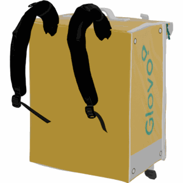 | 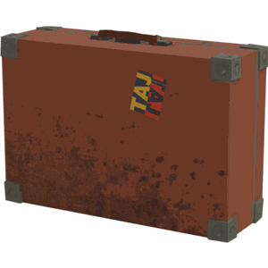 |  | 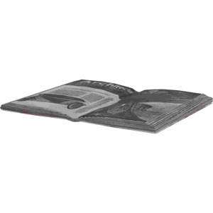 | 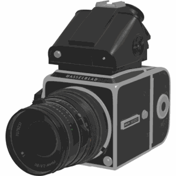 | 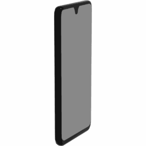 |
|:-:|:-:|:-:|:-:|:-:|:-:|

| 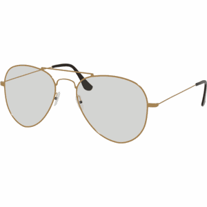 | 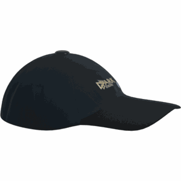 | 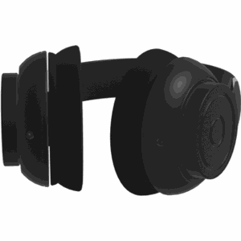 | 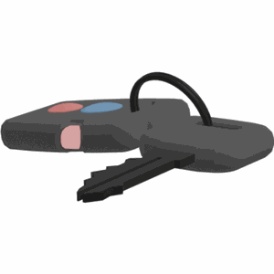 | 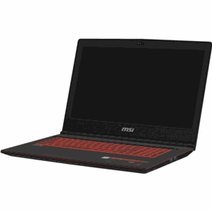 |  |
|:-:|:-:|:-:|:-:|:-:|:-:|

| 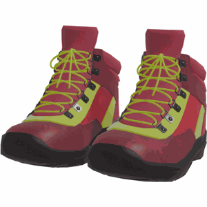 |  |  | 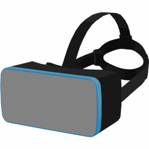 | 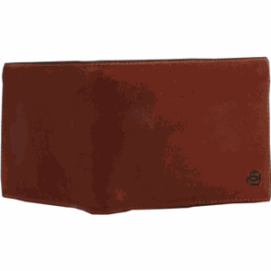 | 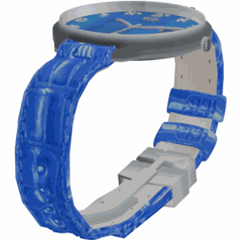 |
|:-:|:-:|:-:|:-:|:-:|:-:|

## :pushpin: Episode Information
Each episode in PInNED consists of a target object instance and a set of distractors. The target object instance is the object that the agent is required to navigate to. The distractors are objects that are not the target object instance. The distractors can be of the same category as the target object instance or of a different category. The distractors are placed in the scene in such a way that they are visible to the agent. The agent is required to navigate to the target object instance while avoiding the distractors.

<details>
<summary>The input given to the agent at each timestep of an episode of PInNED is a list of two elements: the 3 visual references and the 3 textual descriptions of the target instance.</summary>

```
{"pin_goal": [Box(low=0, high=255, shape=(3, 960, 1280, 4), dtype=np.uint8), List[str, str, str]]}
```
</details>

An episode is considered successful if the agent navigates to the target object instance within a maximum geodesic distance of 1 meter.

<details>
<summary>An example of the annotation of an episode is shown below:</summary>

```
{
            "episode_id": "0",
            "scene_id": "hm3d/val/00800-TEEsavR23oF/TEEsavR23oF.basis.glb",
            "start_position": [-0.2826, 0.01338, -6.54213],
            "start_rotation": [0, 0.97997, 0, 0.19917],
            "info": {"geodesic_distance": 8.240373611450195},
            "goals": [
                {
                    "object_category": "backpack",
                    "object_id": "3f5948f7f47343acb868072a7fe92ada",
                    "position": [-5.125668525695801, 1.080200433731079, -0.8120580911636353]
                }
            ],
            "distractors": [
                {
                    "object_category": "backpack",
                    "object_id": "3c47af8b6a3e413f94c74f86d4c396ed",
                    "position": [-3.4595863819122314, 2.2008066177368164, -4.298717021942139]
                },
                {
                    "object_category": "backpack",
                    "object_id": "0b795895343b44b69191ef9b55b35840",
                    "position": [-11.170485496520996, 0.8802012205123901, -0.36090266704559326]
                },
                {
                    "object_category": "backpack",
                    "object_id": "d86ee61984544b45a9f11f49e5e02c43",
                    "position": [-9.1278657913208, 1.21759033203125, -3.52207612991333]
                },
                {
                    "object_category": "mug",
                    "object_id": "d26e9bfce2644bb7af6710c6511ea718",
                    "position": [-7.837601661682129, 0.619335412979126, -0.139740452170372]
                },
                {
                    "object_category": "laptop",
                    "object_id": "6495988c6c044c76a2fc9f9278543c16",
                    "position": [-1.6411572694778442, 0.8701840043067932, -6.151674747467041]
                },
                {
                    "object_category": "headphones",
                    "object_id": "ccf60b0502784fb38e483a6b07cfad53",
                    "position": [3.4111883640289307, 0.8368441462516785, -8.207489013671875]
                },
                {
                    "object_category": "mug",
                    "object_id": "8ee486a0d62c4723a5432c35384d17a5",
                    "position": [-5.827903747558594, 0.8029115200042725, -4.884092330932617]
                },
                {
                    "object_category": "camera",
                    "object_id": "7fbfa0d246c24f78b1ad15335307bac8",
                    "position": [-8.714282035827637, 0.7468401193618774, 0.10284710675477982]
                },
                {
                    "object_category": "cellphone",
                    "object_id": "8abacf30422f4c48842b8ffef5611e0f",
                    "position": [0.5317606925964355, 1.110700011253357, -4.394680023193359]
                }
            ],
            "scene_dataset_config": "data/scene_datasets/hm3d/hm3d_annotated_basis.scene_dataset_config.json",
            "object_category": "backpack",
            "object_id": "3f5948f7f47343acb868072a7fe92ada"
}
```
</details>

## :pushpin: Installation

To install the required dependencies, run the following commands.

Prepare the environment:
```
git clone --recursive -j8 git://github.com/aimagelab/pin.git
conda create -n pin python=3.9 cmake=3.14.0 pybind11
conda activate pin
conda install pytorch=1.13.1 torchvision pytorch-cuda=11.7 -c pytorch -c nvidia
conda install -c fvcore -c iopath -c conda-forge fvcore iopath
conda install pytorch3d -c pytorch3d
conda install pyg pytorch-scatter pytorch-cluster -c pyg
```

Install habitat simulator and its requirements:
```
cd dependencies/habitat-sim
pip install -r requirements.txt
python setup.py install --with-cuda --bullet
```

Install habitat lab and habitat baselines:
```
cd ../habitat-lab
pip install -e habitat-lab
pip install -e habitat-baselines
```

Install PInNED requirements:
```
cd ../..
pip install -r requirements.txt
python3 -m pip install -U 'git+https://github.com/facebookresearch/detectron2.git@ff53992b1985b63bd3262b5a36167098e3dada02'
```

## :pushpin: Dataset Preparation

Follow these steps to prepare the dataset:

1. **Download the HM3D dataset**: Follow the instructions provided [here](https://github.com/facebookresearch/habitat-sim/blob/main/DATASETS.md#habitat-matterport-3d-research-dataset-hm3d) to download the train and val splits of HM3D dataset for use with Habitat.

2. **Move the HM3D scene dataset**: After downloading, move the HM3D scene dataset to `data/scene_datasets/hm3d` in your project directory. Alternatively, you can create a symlink at this location pointing to your HM3D dataset.

3. **Download object assets**: Download the object assets from the [Objaverse-XL](https://objaverse.allenai.org/) dataset. Using this command:
    ```
    python -u objects_download.py
    ```

### Dataset Folder Structure

After downloading and moving the dataset and objects, your `data` folder should have the following structure:

```bash
data
├── scene_datasets/
│   └── hm3d/
│       ├── train/
│       │   └── 00000-kfPV7w3FaU5/
│       │       ├── kfPV7w3FaU5.basis.glb
│       │       ├── kfPV7w3FaU5.basis.navmesh
│       │       ├── kfPV7w3FaU5.semantic.glb
│       │       └── kfPV7w3FaU5.semantic.txt
│       └── val/
│           └── 00800-TEEsavR23oF/
│               ├── TEEsavR23oF.basis.glb
│               ├── TEEsavR23oF.basis.navmesh
│               ├── TEEsavR23oF.semantic.glb
│               └── TEEsavR23oF.semantic.txt
└── datasets
    └── pin/
        └── hm3d/
            └── v1/
                ├── train/
                ├── val/
                ├── objects/
                ├── objects_images/
                └── objects_descriptions.json


```

## :pushpin: Evaluation

To launch a shortest path follower, run the following command:
```     
python models/eval/pin/pin_eval.py --exp_name eval_spf \
--config configs/models/pin/pin_hm3d_v1.yaml habitat.dataset.split=val
```

To evaluate the model with DINOv2, run the following command:
```
python models/eval/pin/distributed_pin_eval.py --exp_name eval_dinov2 \ 
--config configs/models/pin/pin_hm3d_rgb_v1_dino.yaml habitat.dataset.split=val
```

To run experiments without injecting distractors of the same object category as the target object instance, add the following argument:
```
habitat.task.exclude_cat_distractors=True
```

## :pushpin: Acknowledgements
Special thanks to the following projects for providing the codebase used in this project:
- [Habitat-Lab](https://github.com/facebookresearch/habitat-lab) from Facebook Research
- [Habitat-Sim](https://github.com/facebookresearch/habitat-sim) from Facebook Research
- [Habitat-Matterport 3D Dataset (HM3D)](https://github.com/facebookresearch/habitat-matterport3d-dataset) from Facebook Research
- [Objaverse-XL](https://github.com/allenai/objaverse-xl) from Allen Institute for AI
- [CoWs on Pasture](https://github.com/real-stanford/cow) from Robotics & Embodied Artificial Intelligence Lab (REAL) @ Stanford University
- [Home Robot](https://github.com/facebookresearch/home-robot) from Facebook Research

## :pushpin: Licenses and Terms of Use

The episodes of our dataset are built using the scenes from the [HM3D](https://aihabitat.org/datasets/hm3d/) dataset. The HM3D scenes are released under the Matterport End User License Agreement, which permits non-commercial academic use.

To augment the scenes of HM3D with additional objects, our dataset utilizes object assets from the [Objaverse-XL](https://objaverse.allenai.org/) dataset. Objaverse-XL is distributed under the ODC-By 1.0 license, with individual objects sourced from various platforms, including GitHub, Thingiverse, Sketchfab, Polycam, and the Smithsonian Institution. Each object is subject to the licensing terms of its respective source, necessitating users to evaluate license compliance based on their specific downstream applications.

The selected objects of our dataset are restricted to the assets sourced from Sketchfab which are released under the Creative Commons license.
